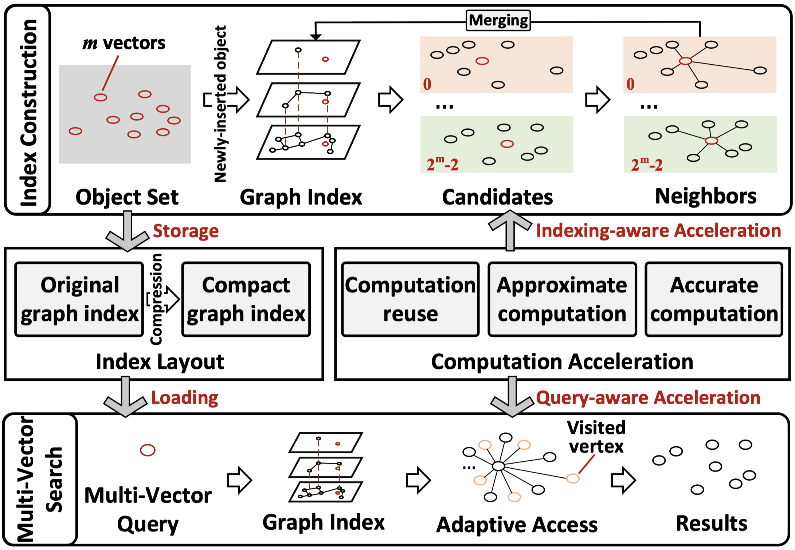
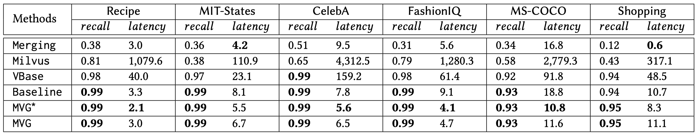

# Source Code for "MVG Index: Empowering Multi-Vector Similarity Search in High-Dimensional Spaces"

## 1. Introduction

Multi-Vector Similarity Search (MVSS) is designed to handle multi-modal or multi-view data, especially with the emergence of multi-modal large language models. In this context, an object or query contains multiple vectors, and similarity between objects involves distances from multiple vector pairs. Existing Vector Similarity Search (VSS) methods, like HNSW, can only handle VSS with one vector in a query or object. Recent studies addressing MVSS through various VSS integrations often suffer from inefficiency and inaccuracy, primarily due to the intrinsic limitations of single-vector indexes.

In our paper "MVG Index: Empowering Multi-Vector Similarity Search in High-Dimensional Spaces", we introduce a specialized Multi-Vector Graph index, denoted as MVG, explicitly designed to tackle the MVSS problem. A more detailed technical report can be found [here](https://github.com/ZJU-DAILY/MVG/blob/main/MVG_technical_report.pdf).

This repository contains the code, datasets, additional evaluations, and other relevant details used in the experiments.

## 2. Competitors

* VBase ([OSDI'23](https://www.usenix.org/conference/osdi23/presentation/zhang-qianxi)): It leverages index scanning optimization with multiple single-vector indexes. Developed by Microsoft, it is the state-of-the-art MVSS method.
* Milvus ([SIGMOD'21](https://dl.acm.org/doi/10.1145/3448016.3457550)): It applies candidate merging optimization with multiple single-vector indexes, released by Zilliz.
* Merging ([TPAMI'14](https://ieeexplore.ieee.org/document/6873347), [IR'05](https://link.springer.com/article/10.1007/s10791-005-6994-4)): It is a previous MVSS method for hybrid queries and also depends on multiple single-vector indexes.

## 3. MVG Overview

For index construction, MVG modularizes the computation acceleration and index compression, allowing easy plug-in/plug-out. The search procedure is adaptive and can accommodate any vector combination of a multi-vector query within a single index. MVG decouples the index layout and computation acceleration from the search procedure, ensuring the flexibility of diverse selections and further optimizations.



## 4. Datasets

The detailed data format instructions can be found [here](./data/README.md).

| Dataset                                                      | $n$ | $m$ or $t$   | $D_m$ | \# $q$          | $w_i$         |
| ------------------------------------------------------------ | ---------- | ---------- | ------- | ------------- | -------------- |
| Recipe ([link](https://github.com/Catoverflow/VBASE-artifacts))       | 1.3M          | 2 | 2,048  | $10^4$  | 0.1/0.2 |
| MIT-States ([link](http://web.mit.edu/phillipi/Public/states_and_transformations/index.html)) | 2.1M          | 6    | 3,456  |  $10^3$  | 0.2/0.15/0.2/0.1/0.2/0.15     |
| CelebA ([link](https://mmlab.ie.cuhk.edu.hk/projects/CelebA.html)) | 1M          | 4     | 2,304  | $10^3$   | 0.2/0.3/0.4/0.1     |
| FashionIQ ([link](https://github.com/XiaoxiaoGuo/fashion-iq)) | 1M          | 2  | 1,024  | $10^3$   | 0.7/0.3 |
| MS-COCO ([link](https://cocodataset.org/#home)) | 1M          | 3    | 1,536     | $10^3$   | 0.4/0.3/0.3 |
| Shopping*                                                    | 1M          | 2     | 1,024  | $10^3$   | 0.7/0.3     |
| MIT-States+ ([link](http://web.mit.edu/phillipi/Public/states_and_transformations/index.html))         | 16M          | 6  | 3,456   | $10^3$   | 0.2/0.15/0.2/0.1/0.2/0.15 |

*Please contact [the author of the dataset](https://sites.google.com/view/kenanemirak/home) to get access to the images.

> $n$ is the number of objects.
> $m$ is the number of vectors in each object.
> $t$ is the number of vectors in a multi-vector query.
> $D_m$ is the total vector dimension in an object.
> \# $q$ is the number of queries.
> $w_i$ is the weight of the $i$-th vector distance.

> Since the original data scale is small (e.g., the scale of CelebA is merely 200K), we expand the datasets using generative models ([Edwards, et al. 2022](https://aclanthology.org/2022.dash-1.8/), [Yang, et al. 2020](https://aclanthology.org/2020.findings-emnlp.90/)), which allows us to create additional samples from the learned distribution of the real data.

## 5. Parameters

For parameter analysis and used values in our experiments, please refer to our technical report ([APPENDIX II](https://github.com/ZJU-DAILY/MVG/blob/main/MVG_technical_report.pdf))

## 6. Usage

### (1) Prerequisites

```shell
GCC 4.8+ with OpenMP
CMake 2.8+
Eigen
```

### (2) Run
(i) Generate transformation matrix
```shell
cd ./data
python eigen_vector_matrix.py
```

(ii) Index construction
```shell
cd ./script
./index_mvg.sh
```

(iii) Index compression
```shell
cd ./script
./index_compress.sh
```

(iv) Search
```shell
cd ./script
./search_mvg.sh
```

## 7. Selected Results

Multi-Vector Query Performance (Latency: ms)


## 8. Acknowledgments

We express our gratitude for the [ADSampling](https://github.com/gaoj0017/ADSampling) repository, which greatly inspires our implementation.