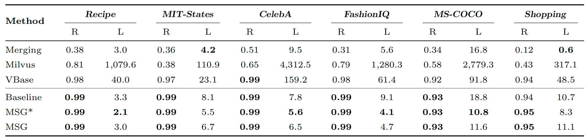

# Source Code for "MSG: a unified multi-space graph index for efficient high-dimensional multi-vector search"

## 1. Introduction

Multi-Vector Search (MVS) is designed to manage multi-modal or multi-view data, particularly in light of the rise of multi-modal large language models. In this context, an object or query comprises multiple vectors, and similarity between objects is determined by distances across multiple vector pairs. Existing Vector Search (VS) methods, such as HNSW, are limited to handling queries or objects with a single vector. Recent approaches to MVS, which rely on VS using multiple single-space indexes, often face challenges in efficiency and accuracy, largely due to the inherent constraints of single-space indexes.

In our paper, *MSG: a unified multi-space graph index for efficient high-dimensional multi-vector search*, we propose a novel Multi-Space Graph index, termed MSG, specifically designed to address the MVS problem.

This repository provides the source code, datasets, and additional implementation details used in the experiments.

## 2. Competitors

* VBase ([OSDI'23](https://www.usenix.org/conference/osdi23/presentation/zhang-qianxi)): VBase, developed by Microsoft, represents the state-of-the-art in Multi-Vector Search (MVS) methodologies. It employs index scanning optimization across multiple single-space indexes to enhance search efficiency and accuracy. This approach positions VBase as a leading solution in the field, particularly for handling complex multi-modal or multi-view data.
* Milvus ([SIGMOD'21](https://dl.acm.org/doi/10.1145/3448016.3457550)): Milvus, released by Zilliz, utilizes candidate merging optimization with multiple single-space indexes to address the challenges of MVS. This method focuses on improving the scalability and performance of the merging operation, making it a robust tool for applications requiring multi-vector processing.
* Merging ([TPAMI'14](https://ieeexplore.ieee.org/document/6873347), [IR'05](https://link.springer.com/article/10.1007/s10791-005-6994-4)): Merging is an earlier MVS technique designed for hybrid queries, relying on multiple single-space indexes to compute similarities. While it laid the groundwork for modern MVS approaches, its reliance on simple merging operation introduces limitations in efficiency and accuracy compared to more recent advancements. Nonetheless, it remains a foundational method in the evolution of MVS technologies.

## 3. MSG Overview

The Multi-Space Graph (MSG) index introduces a modular architecture that separates computation acceleration and index compression, enabling seamless integration and removal of components as needed. This design ensures adaptability, allowing MSG to efficiently handle multi-vector queries with diverse vector combinations and weighting schemes within a unified index framework. By decoupling the index layout and computation acceleration from the search procedure, MSG provides unparalleled flexibility, facilitating diverse configuration choices and enabling further optimizations tailored to specific use cases. This modular and adaptive approach positions MSG as a versatile and scalable solution for high-dimensional multi-vector search challenges.


## 4. Datasets

The detailed data format instructions can be found [here](./data/README.md).

| Dataset                                                      | $n$ | $m$   | $D_m$ | \# $q$          |  $t$         |
| ------------------------------------------------------------ | ---------- | ---------- | ------- | ------------- | -------------- |
| Recipe ([link](https://github.com/Catoverflow/VBASE-artifacts))       | 1.3M          | 2 | 2,048  | $10^4$  | 1~2 |
| MIT-States ([link](http://web.mit.edu/phillipi/Public/states_and_transformations/index.html)) | 2.1M          | 6    | 3,456  |  $10^3$  | 1~6     |
| CelebA ([link](https://mmlab.ie.cuhk.edu.hk/projects/CelebA.html)) | 1M          | 4     | 2,304  | $10^3$   | 1~4     |
| FashionIQ ([link](https://github.com/XiaoxiaoGuo/fashion-iq)) | 1M          | 2  | 1,024  | $10^3$   | 1~2 |
| MS-COCO ([link](https://cocodataset.org/#home)) | 1M          | 3    | 1,536     | $10^3$   | 1~3 |
| Shopping*                                                    | 1M          | 2     | 1,024  | $10^3$   |  1~2   |
| MIT-States+ ([link](http://web.mit.edu/phillipi/Public/states_and_transformations/index.html))         | 16M          | 6  | 3,456   | $10^3$   | 1~2 |

*Please contact [the author of the dataset](https://sites.google.com/view/kenanemirak/home) to get access to the images.

> $n$ is the number of objects.
> $m$ is the number of vectors in each object.
> $t$ is the number of vectors in a multi-vector query.
> $D_m$ is the total vector dimension in an object.
> \# $q$ is the number of queries.
> $w_i$ is the weight of the $i$-th vector distance. It is dynamic at the per-query level.

> Since the original data scale is small (e.g., the scale of CelebA is merely 200K), we expand the datasets using generative models ([Edwards, et al. 2022](https://aclanthology.org/2022.dash-1.8/), [Yang, et al. 2020](https://aclanthology.org/2020.findings-emnlp.90/)), which allows us to create additional samples from the learned distribution of the real data.

## 5. Usage

### (1) Prerequisites

```shell
GCC 4.8+ with OpenMP
CMake 2.8+
Eigen
```

### (2) Run
(i) Generate transformation matrix
```shell
cd ./data
python eigen_vector_matrix.py
```

(ii) Index construction
```shell
cd ./script
./index_msg.sh
```

(iii) Index compression
```shell
cd ./script
./index_compress.sh
```

(iv) Search
```shell
cd ./script
./search_msg.sh
```

## 6. Selected Results

Search performance of multi-vector queries for different methods (Latency : ms). For each dataset, we report Recall@10 (R) and Latency in milliseconds (L). Best results are in bold.


## 7. Acknowledgments

We express our gratitude for the [ADSampling](https://github.com/gaoj0017/ADSampling) repository, which greatly inspires our implementation.